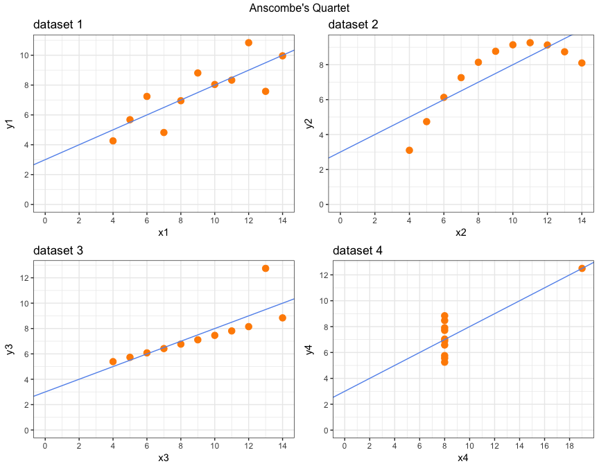

Exploring Anscombe's quartet using R + ggplot2
================
Neil Saunders
2018-03-28 21:55:04

-   [Introduction](#introduction)
-   [The data](#the-data)
-   [Plotting the data](#plotting-the-data)

Introduction
============

[Anscombe's quartet](https://en.wikipedia.org/wiki/Anscombe's_quartet) is a set of four small datasets, constructed to show the importance of visualising data and the dangers of reliance on simple summary statistics.

The data
========

As it is a "classic" dataset, the quartet is included in the R `datasets` package. You can type `?anscombe` for the details, which include example code for analysis and plotting.

First, load required libraries and data.

The `summary` function illustrates some of the identical and near-identical properties of the data. It's also easy to confirm the values for variance, correlation coefficient and linear regression given in the Wikipedia article.

    ##        x1             x2             x3             x4    
    ##  Min.   : 4.0   Min.   : 4.0   Min.   : 4.0   Min.   : 8  
    ##  1st Qu.: 6.5   1st Qu.: 6.5   1st Qu.: 6.5   1st Qu.: 8  
    ##  Median : 9.0   Median : 9.0   Median : 9.0   Median : 8  
    ##  Mean   : 9.0   Mean   : 9.0   Mean   : 9.0   Mean   : 9  
    ##  3rd Qu.:11.5   3rd Qu.:11.5   3rd Qu.:11.5   3rd Qu.: 8  
    ##  Max.   :14.0   Max.   :14.0   Max.   :14.0   Max.   :19  
    ##        y1               y2              y3              y4        
    ##  Min.   : 4.260   Min.   :3.100   Min.   : 5.39   Min.   : 5.250  
    ##  1st Qu.: 6.315   1st Qu.:6.695   1st Qu.: 6.25   1st Qu.: 6.170  
    ##  Median : 7.580   Median :8.140   Median : 7.11   Median : 7.040  
    ##  Mean   : 7.501   Mean   :7.501   Mean   : 7.50   Mean   : 7.501  
    ##  3rd Qu.: 8.570   3rd Qu.:8.950   3rd Qu.: 7.98   3rd Qu.: 8.190  
    ##  Max.   :10.840   Max.   :9.260   Max.   :12.74   Max.   :12.500

    ## [1] 0.8164205 0.8162365 0.8162867 0.8165214

    ## [1] 4.127269 4.127629 4.122620 4.123249

    ## 
    ## Call:
    ## lm(formula = y1 ~ x1, data = anscombe)
    ## 
    ## Coefficients:
    ## (Intercept)           x1  
    ##      3.0001       0.5001

Plotting the data
=================

Using `ggplot2` and `gridExtra` to create plots similar to those in the Wikipedia article.

