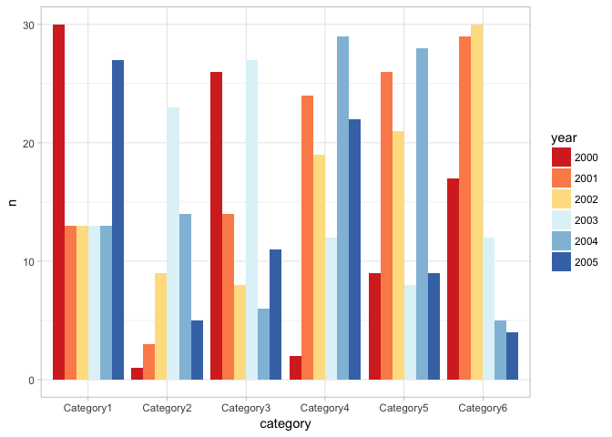
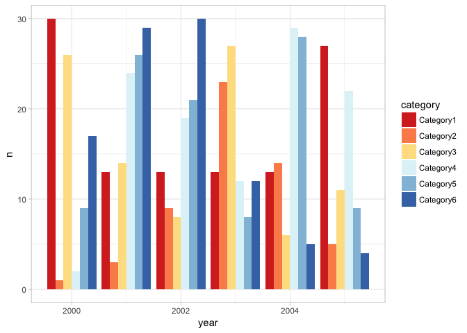
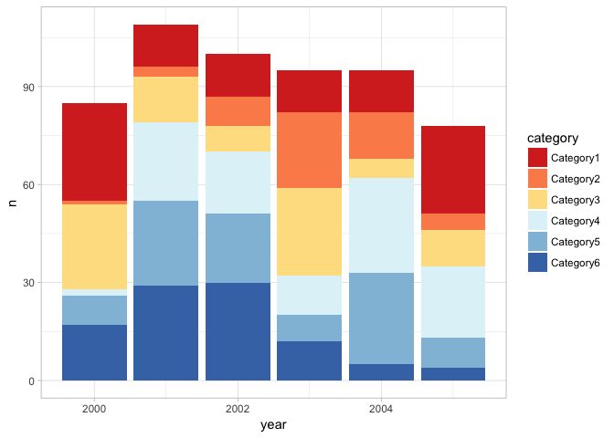
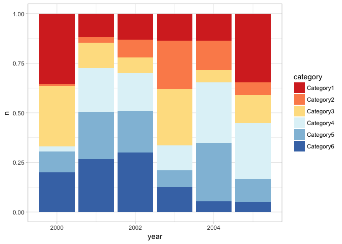
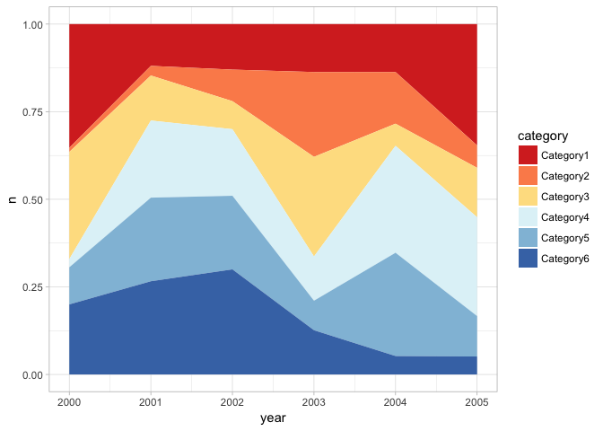
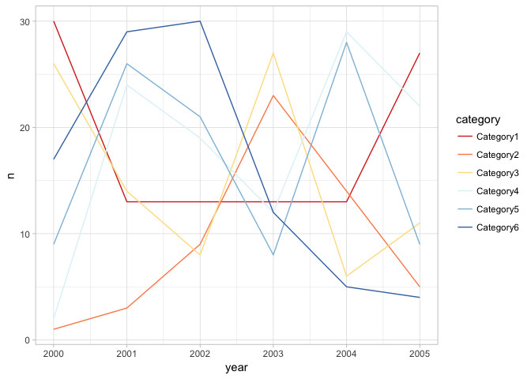
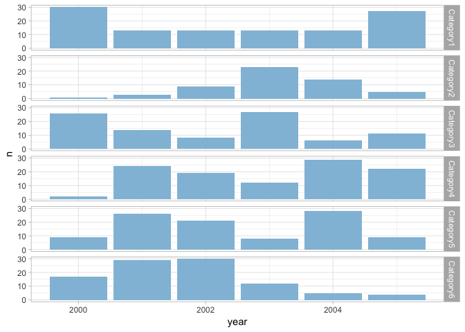
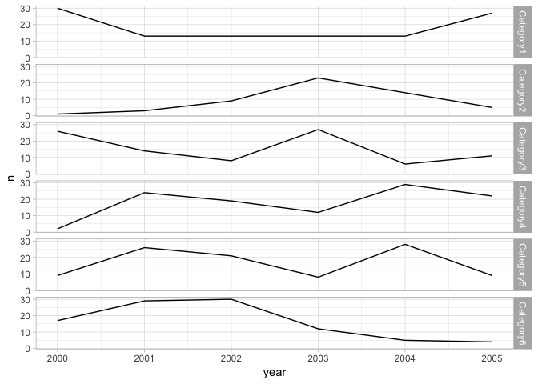
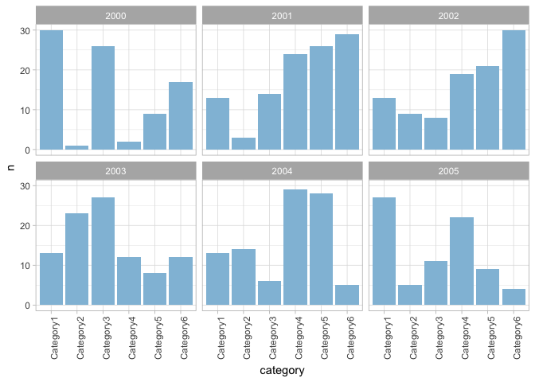
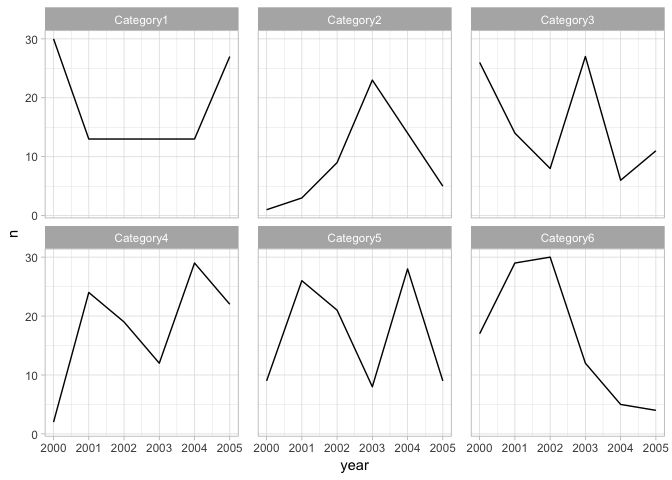

Years as coloured bars: better alternatives using ggplot2
================
Neil Saunders
compiled 2018-03-28 22:12:35

-   [Introduction](#introduction)
-   [Dataset](#dataset)
    -   [Bars coloured by year](#bars-coloured-by-year)
    -   [Bars coloured by category](#bars-coloured-by-category)
    -   [Bars coloured by category, stacked](#bars-coloured-by-category-stacked)
    -   [Bars coloured by category, stacked and filled](#bars-coloured-by-category-stacked-and-filled)
    -   [Area coloured by category, stacked and filled](#area-coloured-by-category-stacked-and-filled)
    -   [Lines coloured by category](#lines-coloured-by-category)
    -   [Facets](#facets)
        -   [Facet grid by category, bars](#facet-grid-by-category-bars)
        -   [Facet grid by category, lines](#facet-grid-by-category-lines)
        -   [Facet wrap by year, bars](#facet-wrap-by-year-bars)
        -   [Facet wrap by category, lines](#facet-wrap-by-category-lines)

Introduction
============

I often see charts with "years as coloured bars". What's better than years as coloured bars?

Dataset
=======

We generate some fake categories over time.

Bars coloured by year
---------------------

This is what we don't want: years as coloured bars within categories.

Bars in one colour with no legend? No (not shown).

Bars coloured by category
-------------------------

Switching categories for years makes it difficult to follow individual categories over time.

Bars coloured by category, stacked
----------------------------------

Stacking makes it difficult to follow categories when a value changes abruptly.

Bars coloured by category, stacked and filled
---------------------------------------------

Stacking and filling creates confusion when values change for any category other than the bottom row.

Area coloured by category, stacked and filled
---------------------------------------------

Area plots help somewhat, but make it difficult to follow changes in absolute value per category.

Lines coloured by category
--------------------------

Overlapping lines are messy.

Facets
------

### Facet grid by category, bars

Facet by category is better but bars are disjointed.

### Facet grid by category, lines

Lines are better but there is still some visual distraction from the other categories.

### Facet wrap by year, bars

This clearly shows categories per year, but we want changes in each category over time. 

### Facet wrap by category, lines

Success! "Years within categories" was correct after all - we just needed to facet and use lines.

